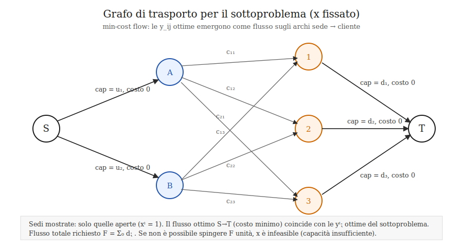

# Facility location

## Formulazione problema

Una azionda ha **n** sedi, il costo di apertura di una sede *i* è **fi** ed è costante.
L'azienda ha **m** acquirenti, ogni acquirente *j* vuole acquistare **dj** unità.  
Il costo di spedizione dalla sede *i* al cliente *j* è **cij**.  
Ipotizziamo inoltre che ogni sede *i* abbia una capacità di produzione massima *ui*.

Ogni sede *i* può essere aperta o chiusa, introduciamo le variabili binarie: *xi* il cui valore è *0* se i è chiusa, *1* altrimenti.

### Formulazione senza limite capacità sedi

Introduciamo la variabile binaria *zij* che assume il valore 1 se la sede *i* fornisce l'acquirente *j*, 0 altrimenti.

La funzione f da **minimizzare** è:

In questo caso possiamo limitarci a impostare ad 1 la *zij* il cui *j = arg min cij* per ogni *i*, in questo modo con le dovute ottimizzazioni il calcolo di tutti gli *zij* viene fatto all'inizio dell'algoritmo in O(n+m).

### Formulazione con capacità sedi

Sostituiamo *zij* con le variabili continue *yij* indicanti la frazione della domanda *dj* soddisfatta dalla sede *i*.

La funzione f da **minimizzare** in questo caso è:

per trovare i valori ottimali di *yij* fissato *x* possiamo interpretare il flusso domanda offerta come grafo:

Il flusso ottimo sugli archi sede->cliente coincide con le yij ottime del sottoproblema di trasporto.

Per risolvere questo sotto problema abbiamo usato Ford-Fulkerson. [TODO] Spiega FF implementalo con BellmanFord e spiega costo e come questo impatta nel progetto

## Scelta linguaggio
Per ora il linguaggio scelto è OCaml per l'algoritmo e python per i plot di valutazione, eventualmente vedrò di passare completamente a python se le librerie esistenti si rivelano essere troppo utili

# [TODO]
praticamente tutto
